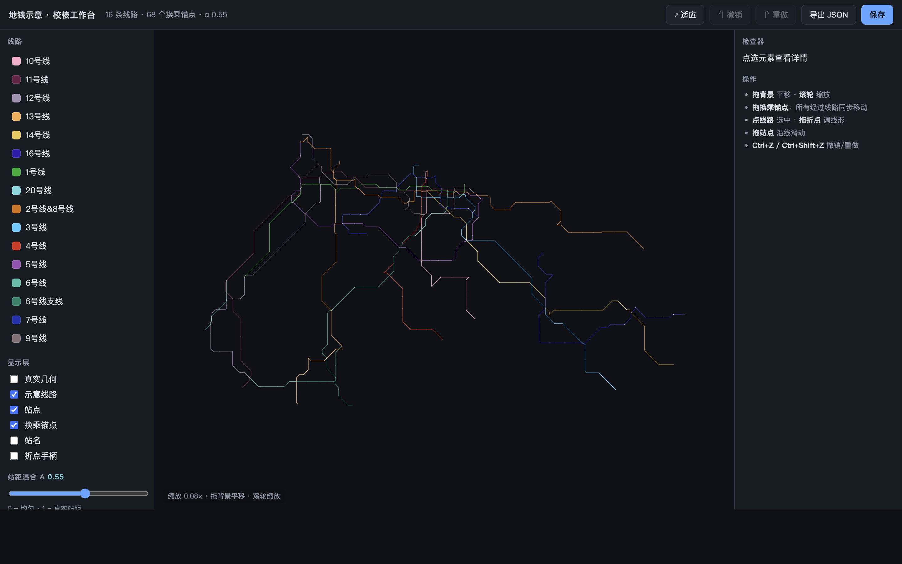
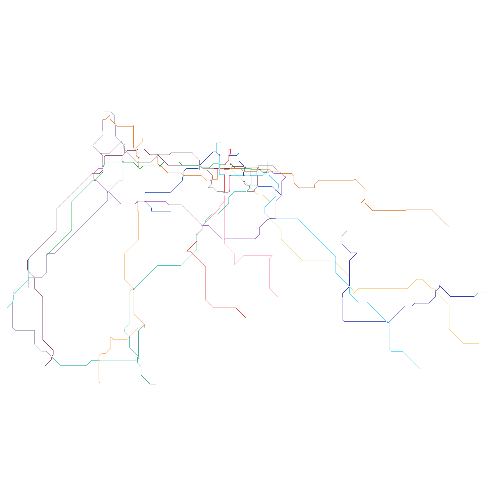
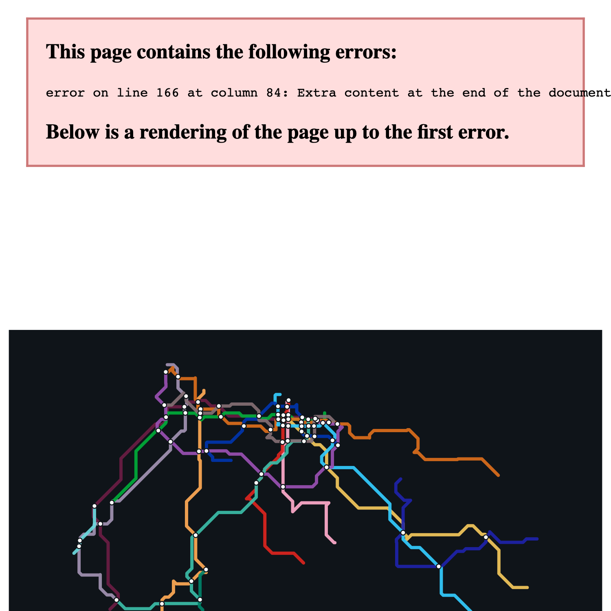

# GLM 贡献 · 地铁示意几何系统

> 本目录由 **GLM（Claude Code，模型 glm-5.2）** 于 **2026-07-27** 生成，归档对 handoff 项目的一次完整改动。
> 代码已**集成在 `metro/` 与 `static/` 原位**（不挪动，以免破坏包结构与导入）；本目录是**文档、可移植补丁、效果图**的集中归档，便于审阅、复现与回退。

---

## 一、这是什么

把 ChatGPT「线路抽象与导出」文档的设计落地成一条**可复现管线**：以真实高德几何为源，生成横竖 / 45° 八方向示意，并用「全网共享换乘锚点」做到**构造性共点**——同一换乘站在所有经过线路的示意里共用同一坐标、骨架强制穿过它，**不再依赖事后 snap**。

### 为什么做

- 站粤 v3 的地铁示意是从第三方（Wahsaw）地图手工适配而来，**已经丢失真实几何**：没有 `geoProgress`，`d` 路径与真实站距/换乘关系之间没有可追溯的推导链。这正是换乘点反复"不共点、一改就崩"的根因（2026-07-26 才用"全局保形重建"修到 68/68 共点）。
- ChatGPT 文档指出正解：**真实几何决定站序/相对站距/换乘关系，示意几何决定线形，换乘站必须是全网共享锚点。**
- 关键发现：文档提议的多数组件其实**已经存在**、只是分散在两个项目里从未串联。本贡献补上唯一缺口并串联成一条管线。

### 文档里"已存在"的组件

| 文档概念 | 已存在 | 位置 |
|---|---|---|
| 真实几何 + `progress` | ✅ | `data/metro_network.json.gz`（`paths.detail` + `stops[].progress`） |
| 八方向示意算法 | ✅ | `static/learn/geometry.js` `buildSchematic()` |
| α 混合 progress | ✅ 部分 | learn 页 `state.balanced` |
| 几何原子工具 | ✅ | `static/learn/core.js` |
| 全局锚点求解 | ✅（站粤侧） | 站粤 `scripts/relayout.js` |
| 校核编辑器 | ✅（但难用） | 站粤 `index.html` 校核抽屉 |

**唯一缺口**：一条"真实→示意 + 全网共享锚点"的可复现管线 + 一个好用的校核工作台。

---

## 二、核心设计（三点）

1. **真实几何为源**：站序、相对站距、换乘关系全部来自高德真实几何（`paths.detail` + `stops[].progress`），示意只是其"抽象投影"。
2. **八方向示意**：线形只允许水平/垂直/45°，更像地铁图；普通站不参与折线控制，只按 progress 落点。
3. **构造性共点（取胜点）**：换乘锚点先在全网求解出**单一坐标**，每条线路的骨架被**强制穿过**自己的锚点。共点由构造保证，不靠事后 snap —— 这从结构上根除站粤反复崩的根因。

站距用文档推荐的 **α 混合**：`schematicProgress = α·real + (1−α)·even`，α=0 均匀、α=1 纯真实、默认 0.55。

---

## 三、架构与数据流

```
handoff(Python) ── 一条龙 ──────────────────────────────────────────┐
                                                                    │
  metro/build_network.py                                            │
    └─ metro/schematic.py                                           │
         ① 端口 buildSchematic (JS→Python，逐点 bit-identical)      │
         ② compute_anchors()：全网换乘锚点（≥2 条不同线路）          │
         ③ 线路骨架强制穿过锚点（共点由构造保证）                    │
         ④ α 混合 progress 投影站点                                  │
    └─ network dict 增加 schematic / transfer_anchors 字段           │
    └─ 写入 data/metro_network.json.gz                              │
                                                                    │
  metro/router.py                                                   │
    ├─ GET  /metro/studio          → static/metro_studio.html       │
    ├─ GET  /api/metro/schematic   → 真实+示意+锚点（无则即时生成）  │
    └─ POST /api/metro/schematic/save → data/metro_schematic_layout.json │
                                                                    │
  static/metro_studio.{html,css,js}  ← 校核工作台（消费 core.js/geometry.js）│
                                                                    │
  metro/export_zhanyue.py  ← 冻结 layout → 站粤 DATA 格式            │
                                                                    ▼
                        data/metro_schematic_layout.json（冻结）
                                                                    │
              ── 站粤 仅做数据替换（零代码改动） ─────────────────────▶
                        index.html DATA.lines[]（d + stations[].progress）
```

---

## 四、改动清单（7 个文件）

| 类型 | 文件 | 作用 |
|---|---|---|
| 新建 | `metro/schematic.py` | 生成器：端口 `geometry.js` + 锚点求解 + 构造性共点 |
| 新建 | `metro/export_zhanyue.py` | 冻结布局 → 站粤 v3 `DATA.lines[]` |
| 新建 | `static/metro_studio.html` | 校核工作台页面 |
| 新建 | `static/metro_studio.css` | 工作台样式 |
| 新建 | `static/metro_studio.js` | 工作台逻辑（transform 式 pan/zoom、拖锚点联动等） |
| 修改 | `metro/build_network.py` | `build()` 调 `build_schematic_network`；CLI 开关 |
| 修改 | `metro/router.py` | 3 个新路由（studio 页 + schematic GET/POST） |

> 详见 [`FILES.txt`](FILES.txt)（带增删行数统计）与 [`CHANGES.patch`](CHANGES.patch)（完整可移植补丁）。

---

## 五、数据模型（`metro_network.json.gz` 增量字段）

真实几何 `paths.detail` / `stops[].progress` **保留不动**，仅新增示意字段：

```jsonc
// network 顶层
{
  "schematic_alpha": 0.55,                 // 真实/均匀混合系数
  "transfer_anchors": {                    // 全网共享锚点：键 = 归一化站名
    "会展中心": {"name":"会展中心","x":4520.55,"y":4567.54,"lines":["1号线","4号线"]}
  }
}
// 每条 forward 路由
{
  "schematic": {
    "path": [[x,y], ...],                  // 八方向折线（世界坐标，与 paths.detail 同空间）
    "station_progress": [0.0, 0.085, ...], // 每站沿示意路径的 progress（已 α 混合）
    "anchor_indices": [0, 3, 7, 12],       // 该线上是换乘锚点的站点序号
    "bbox": [minX,minY,maxX,maxY]
  }
}
```

---

## 六、关键算法

- **端口一致性**：`schematic.py` 的纯数学函数与 `static/learn/geometry.js` + `core.js` **一一对应**（同名同算法同常量）。当 `alpha=None` 时 `build_schematic_route` 与 JS `buildSchematic` **逐点 bit-identical**（已验证）。
- **换乘识别**：`compute_anchors` 用 `len(set(route_nos)) >= 2`（**不是** `route_count`，后者把 forward/reverse 同线算两次，会让终点站误判为换乘）。位置取该站所有实例真实坐标的**质心**，从而跨线共享。
- **八方向折线路由 `_octilinear_midpoints`**：把任意两定点 (A→B) 的位移分解为"一段轴向（水平/垂直）+ 一段 45° 对角"，≤2 段、保证终于 B、纯八方向。
- **构造性共点**：每条线的锚点序列 = 端点 + 换乘 + 真实形状折点（RDP），骨架在相邻锚点间走八方向折线 → 同一换乘锚点跨线天然同坐标。
- **α 混合站距**：按相邻"站点锚点"分段，段内 `weight = α·real_span + (1−α)·even_span` 落到弧长上。

---

## 七、如何运行

```bash
cd /Users/EasyMaker/Desktop/shenzhen_bus_network_handoff_py39_fixed
source .venv/bin/activate          # Python 3.9

# 1) 构建（生成真实几何 + 示意，烘焙进 gz）
python -m metro.build_network
#   可选：--schematic-alpha 0.6  --schematic-bend 120  --no-schematic

# 2) 启服务
./run.sh                            # uvicorn app:app → http://127.0.0.1:8000

# 3) 打开校核工作台
#    浏览器访问 http://127.0.0.1:8000/metro/studio

# 4) 在工作台调好后，冻结导出为站粤格式
python -m metro.export_zhanyue
#   → data/zhanyue_metro_data.json（把 lines[] 替换进站粤 index.html 的 let DATA）
```

> 即便不重新构建 gz，`GET /api/metro/schematic` 也会在内存里**即时生成**示意（不落盘），工作台开箱即用。

---

## 八、校核工作台（`/metro/studio`）



全页零构建（vanilla JS + SVG），三栏布局。**transform 式平移/缩放**（视口变化零重建节点 → 丝滑），拖拽走**定点属性更新**（不重建整层）。

| 操作 | 效果 |
|---|---|
| 拖背景 / 滚轮 | 平移 / 缩放（围绕光标） |
| **拖换乘锚点** | **所有经过线路同步移动**（共享锚点契约的可视化） |
| 点线路 | 选中（其余淡出） |
| 拖折点手柄 | 调线形（需开"折点手柄"层） |
| 拖站点 | 沿线滑动（min-gap 强制） |
| α 滑杆 | 实时在真实站距 ↔ 均匀站距间流动 |
| Ctrl+Z / Ctrl+Shift+Z | 撤销 / 重做 |
| 保存 / 导出 | 写 `metro_schematic_layout.json` / 下载 JSON |

---

## 九、验证结果

| 项 | 结果 |
|---|---|
| Python 端口 vs JS `buildSchematic` | **0.00e+00 差异，bit-identical** |
| 全网换乘共点误差 | **≤ 0.0098 世界单位**（68 锚点跨线坐标完全一致） |
| 149 个锚点-线路链接，锚点是否为折点 | **≤ 0.01 单位** → 拖锚点必正确锁定多线 |
| `python -m metro.build_network` | 16 线全有 schematic，progress 单调 |
| 工作台无头截图 | 正常渲染，无 JS 错误 |
| 保存→重载往返 | **PASS**（α/锚点/路径覆盖都正确持久化） |
| 导出站粤格式 | 字段序/类型/viewBox 落点正确，432 站 149 换乘 |

### 效果图

- 全网八方向示意（生成器直出）：
- 站粤格式导出预览（投影到 viewBox「20 45 1240 625」）：

---

## 十、如何回退

代码改动已分成两个提交：`31482aa`（基线/原版）与 `68c4d52`（本次功能）。

```bash
# 完整回到原版（丢弃本次所有改动）
git reset --hard 31482aa

# 保留历史、生成反向提交撤销功能
git revert 68c4d52

# 只看本次改了什么
git show 68c4d52 --stat
git diff 31482aa 68c4d52

# 把补丁应用到任意干净树（可移植）
git apply GLM/CHANGES.patch
```

---

## 十一、与站粤的关系

- 站粤 v3（`/Users/EasyMaker/Desktop/站粤/站粤-交互优化版-v3`）**零代码改动**，只做数据替换。
- 学习页仍按 `progress` 沿 `d` 取点渲染（站粤既有 `pointAtProgress`），安全。
- 音频 / 拼音 / 搜索 / 统计继续走真实数据体系，不受影响。
- 导出字段序遵循站粤约定：`name, x, y, progress, transfer, lineCount, pinyin, reviewStatus, reviewNote, audioUrl`。

---

## 十二、本目录文件

| 文件 | 说明 |
|---|---|
| `README.md` | 本文档 |
| `CHANGES.patch` | 基线→功能的完整可移植补丁（`git apply` 即可复现改动） |
| `FILES.txt` | 改动文件清单与增删行数 |
| `assets/studio-workbench.png` | 校核工作台截图 |
| `assets/schematic-full-network.png` | 全网八方向示意（生成器直出） |
| `assets/zhanyue-export.png` | 站粤格式导出预览 |

---

*生成工具：Claude Code（glm-5.2）· 日期：2026-07-27*
